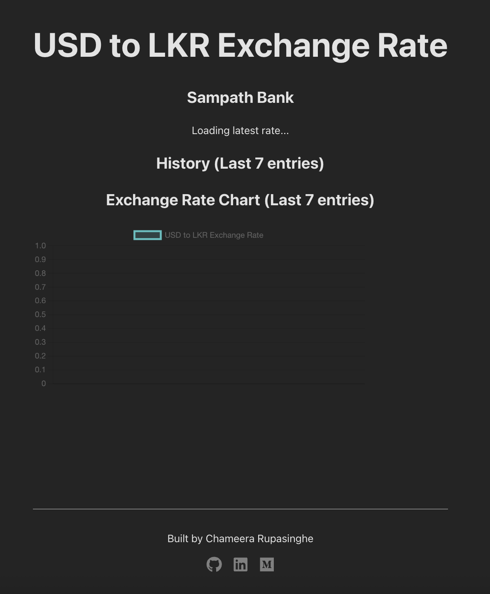

# 💻 USD LKR Exchange Rate Dashboard – Frontend

This is a simple React-based frontend application that visualizes the USD exchange rate fetched from the backend service. It fetches the last 7 recorded exchange rates and plots them in a line chart for easy tracking.

---

## 📦 Features

- Fetches historical USD exchange rates from the backend
- Displays data on a responsive line chart using [Recharts](https://recharts.org/)
- Clean and minimalistic UI
- Footer with links to GitHub, LinkedIn, and Medium

---

## 🛠️ Tech Stack

- React (Vite)
- TypeScript
- Recharts

---

## 🚀 Getting Started

### 1. Clone the repository

```bash
git clone https://github.com/chameerar/usd-lkr-exchange-rate-dashboard.git
cd usd-lkr-exchange-rate-dashboard/frontend
```

### 2. Install dependencies

```bash
npm install
```

### 3. Run the frontend

```bash
npm run dev
```

The app will be available at: `http://localhost:5173`

---

## 🔌 API Integration

The frontend expects the backend to be running at:

```
http://localhost:8080
```

Make sure the backend is running and reachable. Update the API base URL in the `public/config.js` if needed

---

## 📸 Screenshot



---

## 📜 License

MIT – use freely and customize as needed.
